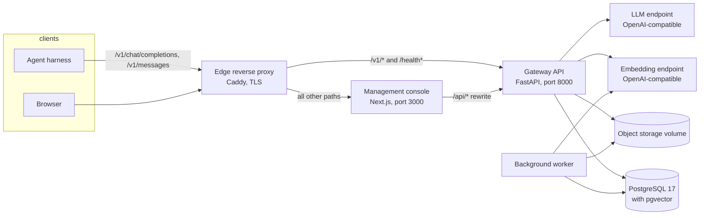

# AI Knowledge Gateway

AI Knowledge Gateway is a self-hosted service that sits between coding agents and LLM inference backends and gives them a persistent, shared knowledge base. It runs as three cooperating components: a FastAPI gateway API, a background worker, and a Next.js management console, backed by one PostgreSQL database with the pgvector extension. The Compose project name is `kinbase`; the Python package is `local-ai-gateway`.

On the client side the gateway speaks the OpenAI chat protocol (`/v1/chat/completions`) and the Anthropic messages protocol (`/v1/messages`), both in JSON and Server-Sent Events streaming mode. Tools such as Cursor, Continue, or Roo Code, and any custom harness, can point at it without code changes. On the backend side it forwards traffic to any OpenAI-compatible inference server, for example vLLM, Ollama, or a hosted endpoint, and to any OpenAI-compatible embeddings endpoint.

The feature that separates it from a plain proxy is the knowledge subsystem. The gateway attaches five internal tools to every conversation and executes them itself against PostgreSQL:

- `knowledge_search` runs hybrid retrieval, combining lexical full-text search and vector similarity, fused with weighted Reciprocal Rank Fusion.
- The management console provides explicit knowledge lifecycle operations; provider conversations receive retrieval only.

The model uses this tool to carry context across sessions: project decisions, coding standards, environment details, user preferences. The client harness never sees the call. Tool calls that are not gateway-supported knowledge tools are passed straight back to the client, so existing agent workflows keep working unchanged.

Around this core the gateway provides a complete management plane: member accounts with password login and TOTP multi-factor authentication, browser sessions with rotating refresh tokens, personal API keys with scoped permissions, spaces for isolating knowledge per project or team, durable asynchronous document ingestion, an audit trail, and runtime-adjustable retrieval settings. A Next.js console exposes all of it in the browser.

## Key features

- Dual protocol support: OpenAI and Anthropic endpoints, JSON and SSE streaming, including reasoning output (`reasoning_content` and `thinking` blocks) in both directions.
- Transparent tool interception. Internal knowledge tools are resolved inside the gateway within the same request, under bounded budgets for iterations, total tool calls, repeated signatures, and wall-clock time.
- Hybrid retrieval. PostgreSQL full-text search (`tsvector` with GIN indexes) and pgvector cosine search over HNSW indexes run in parallel and are fused with weighted Reciprocal Rank Fusion. Weights, cutoffs, and search depth are adjustable at runtime without a restart.
- Knowledge versioning. Every write creates an immutable revision with a SHA-256 content hash. Updates and deletes require `expected_version` and fail with a conflict instead of overwriting newer data.
- Spaces and authorization. Knowledge is scoped per space with owner, editor, and reader roles, a global scope readable everywhere, and row-level security enforced in the database.
- Durable ingestion. Uploads return immediately with an ingestion job; a leased background worker parses, chunks, embeds, and activates documents with retries and idempotency keys.
- Identity. Argon2 password hashing, TOTP enrollment with recovery codes, per-account and per-IP login throttling, session families with refresh rotation and reuse detection.
- Management API. A cursor-paginated `/api/v1` surface covers members, sessions, API keys, spaces, knowledge, sources, ingestion jobs, audit events, runtime settings, and confirmed AI management actions.
- Operational safety. Production configuration validation refuses wildcard CORS, debug logging, legacy static keys, or missing encryption material at startup; readiness fails closed when the schema is incompatible.
- Observability. Structured JSON logs with trace correlation, a Prometheus `/metrics` endpoint, and an alert rule catalog under `deploy/prometheus/`.
- Recovery tooling. Encrypted coordinated backups with checksums and a storage manifest, plus verified restore drills and monthly restore rehearsals driven from CI.

## System overview



The gateway process serves both the agent-facing protocol endpoints and the management API. The web console is a separate Node process that proxies its `/api/*` routes to the gateway and keeps browser sessions in `__Host-` prefixed cookies. The worker is an independent process that claims ingestion jobs, dispatches outbox events, reconciles object storage, and optionally executes retention purges. PostgreSQL is the only persistent store; uploaded files live in a shared storage volume referenced by the database.

A detailed component and data-flow description is in [docs/architecture.md](docs/architecture.md).

## Repository layout

```
alembic/                  Database migrations (001 through 018)
deploy/                   Caddyfile, PostgreSQL init and grant scripts, Prometheus alerts
docs/                     Additional documentation
requirements/             Hash-pinned lockfiles (runtime.lock, dev.lock) and policy
scripts/                  Backup, restore, recovery verification, OpenAPI export tools
src/gateway/
  main.py                 FastAPI app factory, middleware stack, lifespan
  worker.py               Background worker entry point
  cli.py                  migrate, current, check, bootstrap-super-admin, recover-super-admin
  config.py               Settings loaded from environment and .env
  observability.py        Structured JSON logging and trace headers
  domain/                 Canonical types, entities, tools, prompts, identity, exceptions
  application/
    ports/                Abstract interfaces: repositories, clients, storage
    security/             Password hashing, token handling, TOTP
    services/             Chat orchestrator, knowledge, retrieval, ingestion, sessions,
                          API keys, spaces, members, settings, retention, outbox
    parsers/              Text, code, JSON, PDF parsers and the chunker
  infrastructure/
    database.py           Async engine, session factories, role validation
    migrations.py         Programmatic Alembic runner and schema status
    readiness.py          Cached single-flight readiness probe
    adapters/             HTTP LLM client, HTTP embedding client, resilience policies
    persistence/          ORM models and repository implementations
    storage/              Versioned local object storage
  presentation/
    auth.py               Authentication middleware
    converters/           OpenAI and Anthropic protocol adapters
    schemas/              Request and response models
    routers/              chat, messages, models, files, health, management, management auth
tests/
  unit/                   Unit and protocol-contract tests
  integration/            PostgreSQL integration suite
  e2e/                    Five-tier end-to-end suite and its runner harness
  operations/             Operational guard scripts
  load/                   k6 load budget script
web/                      Next.js management console
```

## Technology stack

| Component | Technology | Role |
|---|---|---|
| Gateway API | Python 3.11+, FastAPI, Pydantic v2, SQLAlchemy 2 async, uvicorn | Protocol endpoints, management API, orchestration |
| Worker | Python, asyncio | Ingestion jobs, outbox dispatch, storage maintenance, retention |
| Database | PostgreSQL with pgvector (pinned at 17 in Compose and CI) | Knowledge, identity, jobs, audit; full-text and vector search |
| Migrations | Alembic | Versioned schema, applied by explicit CLI or Compose service |
| Web console | Next.js 16, React 19, TypeScript | Management UI, session gate, typed API client |
| Edge | Caddy 2 | TLS termination, routing, compression |
| Auth | Argon2, TOTP (pyotp), Fernet (cryptography) | Passwords, MFA, encrypted factor secrets |
| Testing | pytest, vitest, Playwright, k6 | Python tests, web unit tests, browser tests, load budgets |

## Quick start

The full procedure, including native and Compose-based workflows, is in [docs/installation.md](docs/installation.md). In outline:

```bash
# 1. Python environment
python -m venv .venv
source .venv/bin/activate        # Windows PowerShell: .venv\Scripts\Activate.ps1
pip install --require-hashes -r requirements/dev.lock

# 2. Configuration
cp .env.example .env             # then edit DATABASE_URL and backend URLs

# 3. Database migrations (PostgreSQL with pgvector must be reachable)
python -m src.gateway.cli migrate
python -m src.gateway.cli check

# 4. First administrator (prints a temporary password)
python -m src.gateway.cli bootstrap-super-admin --username admin --display-name "Admin"

# 5. API and worker
uvicorn src.gateway.main:app --host 0.0.0.0 --port 8000
python -m src.gateway.worker     # in a second terminal

# 6. Web console (in a third terminal)
cd web
npm ci
npm run dev
```

Interactive API documentation is served at `/docs` once the gateway runs.

## Configuration

All settings load from the environment and a `.env` file. Two templates exist: `.env.example` for development and `.env.production.example` for the Compose deployment. The complete variable reference, including defaults, allowed ranges, and the production safety rules, is in [docs/configuration.md](docs/configuration.md).

## Authentication in brief

Agent-facing `/v1` endpoints accept a personal API key as `Authorization: Bearer <key>` or `x-api-key: <key>`. Keys are created in the console or via `POST /api/v1/api-keys`, stored only as peppered hashes, and carry scopes such as `knowledge:read` and `knowledge:write`.

The management console and `/api/v1/auth/*` use browser sessions: username and password (plus a TOTP or recovery code for super admins), an access cookie valid 15 minutes, a path-scoped refresh cookie with a 7-day idle and 30-day absolute lifetime, and CSRF protection on rotation. See [docs/security.md](docs/security.md) for the full model.

## API surface

| Area | Endpoints |
|---|---|
| Health | `GET /healthz/live`, `GET /healthz/ready`, `GET /health`, `GET /v1/health`, `GET /metrics` |
| OpenAI protocol | `POST /v1/chat/completions`, `GET /v1/models`, `GET /v1/models/{model_id}` |
| Anthropic protocol | `POST /v1/messages` |
| Management auth | `POST /api/v1/auth/login`, `refresh`, `step-up`, `password`, `mfa/totp/enroll`, `mfa/totp/confirm`, `logout` |
| Management | `/api/v1/me`, `/spaces`, `/knowledge`, `/retrieval/search`, `/sources`, `/ingestion-jobs`, `/api-keys`, `/members`, `/sessions`, `/audit-events`, `/settings`, `/ai-tools`, `/ai-actions`, `/operations/summary` |

The exported OpenAPI document at `/openapi.json` is the authoritative HTTP contract; the generated TypeScript client in `web/lib/generated/openapi.ts` is compiled from it and must stay in sync. Request and response details are in [docs/api.md](docs/api.md).

## Testing

```bash
pytest                                   # Python suite (unit tests run without services)
pytest tests/integration                 # PostgreSQL integration suite
python -m tests.e2e.harness.runner --tier all   # five-tier end-to-end suite

cd web
npm test -- --run                        # vitest component tests
npm run test:browser                     # Playwright browser and accessibility tests
```

Integration tests need a PostgreSQL URL with pgvector, provided through `TEST_DATABASE_URL` or the configured `DATABASE_URL`. The complete test inventory, markers, and environment requirements are in [docs/testing.md](docs/testing.md).

## Deployment

The repository ships a hardened Compose stack: pinned images, non-root read-only containers, an internal-only database network, dedicated database roles for the runtime, the worker, and retention functions, and a Caddy edge that publishes only ports 80 and 443. Production deployment, CI/CD gates, backup and restore, monitoring, and the recovery objectives are documented in [docs/deployment.md](docs/deployment.md) and [docs/operations.md](docs/operations.md).

## Documentation index

| Document | Purpose |
|---|---|
| [docs/architecture.md](docs/architecture.md) | Components, layering, request and data flows, worker pipeline |
| [docs/installation.md](docs/installation.md) | Prerequisites and step-by-step local setup |
| [docs/configuration.md](docs/configuration.md) | Complete environment variable reference |
| [docs/api.md](docs/api.md) | HTTP API reference for protocol and management endpoints |
| [docs/database.md](docs/database.md) | Schema, migrations, database roles, row-level security, retention |
| [docs/security.md](docs/security.md) | Authentication, authorization, sessions, secrets, production guards |
| [docs/testing.md](docs/testing.md) | Test layers, runners, markers, and CI test jobs |
| [docs/deployment.md](docs/deployment.md) | Production stack, CI/CD workflows, backup and restore, monitoring |
| [docs/operations.md](docs/operations.md) | Operator runbook: backups, recovery rehearsals, rotation, alerting |
| [docs/troubleshooting.md](docs/troubleshooting.md) | Diagnosis of common setup and runtime problems |

## License

Released under the MIT License. See [LICENSE](LICENSE) for details.
