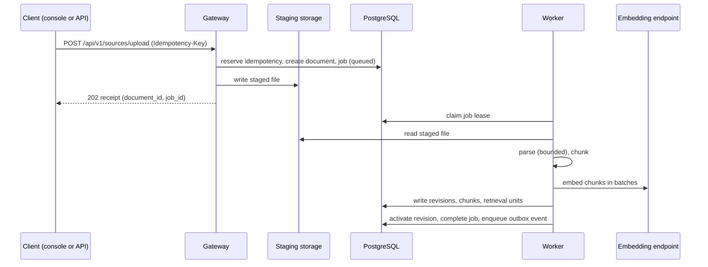

# Architecture

This document describes the runtime components of AI Knowledge Gateway, how they communicate, and how data flows through the system. All statements are derived from the implementation under `src/gateway`, `web/`, and `compose.yaml`.

## Components

The deployed system consists of six units, matching the services defined in `compose.yaml`:

| Component | Process | Responsibility |
|---|---|---|
| Edge | Caddy 2 | Public TLS termination on ports 80 and 443; routes `/v1/*` and `/health*` to the gateway and everything else to the web console |
| Web console | Next.js standalone server, port 3000 | Browser UI for the management plane; rewrites `/api/*` to the gateway |
| Gateway API | `uvicorn src.gateway.main:app`, port 8000 | Agent protocol endpoints, management API, authentication, chat orchestration, retrieval |
| Worker | `python -m src.gateway.worker` | Ingestion jobs, outbox dispatch, storage reconciliation, optional retention purges |
| Database | PostgreSQL 17 with pgvector | Single persistent store for all state |
| Object storage | Shared volume mounted at `/data/storage` | Uploaded and versioned document files |

PostgreSQL and the worker sit on an internal network that is not reachable from outside the Compose project. The gateway and the web console each hold credentials for their own dedicated database role; see [database.md](database.md).

## Gateway internals

### Layered design

The codebase is organized in four layers with dependencies pointing inward:

- Presentation (`src/gateway/presentation`): FastAPI routers, Pydantic request and response schemas, OpenAI and Anthropic converters, authentication and security-header middleware, error handlers, and the metrics endpoint.
- Application (`src/gateway/application`): the chat orchestrator, knowledge and retrieval services, ingestion and job services, identity, sessions, API keys, spaces, member administration, runtime settings, retention, and the document parsers. This layer declares the port interfaces (repositories, clients, storage) under `application/ports`.
- Domain (`src/gateway/domain`): canonical message types, entities, tool definitions, prompt composition, identity and authorization enums, and exceptions. Pure Pydantic models with no I/O.
- Infrastructure (`src/gateway/infrastructure`): the async SQLAlchemy engine and session factories, the programmatic Alembic runner, ORM models and repository implementations, HTTP clients for the LLM and embedding backends with resilience policies, and the versioned local object storage adapter.

### Application factory and middleware

`create_app` in `src/gateway/main.py` builds the FastAPI application. Before the app object is created it runs `validate_runtime_safety`, which rejects unsafe production configurations (see [security.md](security.md)). The middleware stack, in order of registration:

1. `APIKeyAuthMiddleware`: authenticates every request that is not on a public path. It resolves browser sessions from the access cookie, personal API keys from bearer tokens or `x-api-key`, and optionally legacy static keys. It binds the authenticated principal into the request and the database session context used by row-level security.
2. `CORSMiddleware`: allows only the explicitly configured origins.
3. `TrustedHostMiddleware`: rejects requests with a `Host` header outside the allowlist.
4. `SecurityHeadersMiddleware`: adds defensive response headers.
5. `RequestContextMiddleware`: assigns a request id and trace headers.
6. `SettingsContextMiddleware`: makes settings available across async contexts.
7. `RequestBodyLimitMiddleware`: rejects bodies larger than `MAX_REQUEST_BODY_BYTES`.
8. `MetricsMiddleware`: records request counters, active request gauges, and latency into the in-process registry.

A `/metrics` endpoint renders the registry in Prometheus text format and is publicly reachable without authentication so that a scraper on the internal network can poll it.

### Lifespan

On startup the gateway performs a read-only schema status check (current Alembic revision and embedding dimension compatibility). The result is stored on `app.state`:

- If the schema is incompatible, the gateway still starts and `/healthz/live` stays green, but `/healthz/ready` fails closed with `schema_incompatible`.
- In production it additionally validates that the runtime database role has exactly the privileges the application expects.

Migrations are never applied during web startup. They are an explicit deployment step through `python -m src.gateway.cli migrate` or the one-shot `migrate` Compose service.

On shutdown the gateway closes the database engine and the shared HTTP client pools for the LLM and embedding backends.

## Chat request flow

A request on `POST /v1/chat/completions` or `POST /v1/messages` passes through the following stages:

1. Authentication by the middleware, then protocol conversion. The OpenAI or Anthropic payload is translated into the internal canonical message format; protocol-specific details stop at the presentation layer.
2. The orchestrator appends the five knowledge tool schemas to whatever tools the client sent and forwards the combined list upstream, together with the composed system prompt. The system prompt directive (configurable or disable-able through `KNOWLEDGE_SYSTEM_PROMPT_*`) tells the model when to search, save, update, and delete.
3. The upstream call goes through the resilience wrapper: bounded concurrency (bulkhead), bounded retries with exponential backoff for transient failures (connection errors, 408, 429, 5xx), and a circuit breaker that opens after consecutive failures and probes recovery after a cool-down.
4. If the model responds with only internal tool calls, the gateway executes them against the database, appends the results to the conversation, and calls the model again. The client sees none of these round trips.
5. If the model responds with an external tool call, the gateway returns it to the client and ends the turn. The client executes the tool and returns the result with its next request, as in any OpenAI- or Anthropic-style agent loop.
6. The loop terminates when the model produces a plain answer or a guardrail trips.

Guardrails enforced by the orchestrator:

| Limit | Setting | Default |
|---|---|---|
| Model round trips per request | `MAX_TOOL_ITERATIONS` | 10 |
| Internal tool calls per request | `MAX_INTERNAL_TOOL_CALLS` | 32 |
| Executions of one identical tool signature | `MAX_REPEATED_TOOL_SIGNATURES` | 2 |
| Wall-clock budget for one orchestrated request | `MAX_TOOL_WALL_CLOCK_SECONDS` | 180.0 |
| Timeout for a single internal tool execution | `TOOL_TIMEOUT_SECONDS` | 15.0 |

In streaming mode, internal tool rounds are buffered and never emitted. The client stream contains only final text, reasoning deltas, and external tool calls.

## Knowledge tools and retrieval

The provider conversation catalog exposes one internal tool, `knowledge_search`. Legacy `knowledge_*` names remain reserved so clients cannot shadow them, but unavailable reserved calls fail closed rather than mutate data. Any other tool name is treated as external and passed through.

`knowledge_search` runs two channels in parallel over knowledge items and document chunks:

1. Lexical: the query is sanitized into AND-connected terms and matched against a generated `to_tsvector('english', ...)` column with GIN indexes, ranked with `ts_rank_cd`. Multilingual index variants are maintained by migration 015.
2. Vector: the query is embedded by the embedding backend and matched against the pgvector column using cosine distance over an HNSW index.

Both channels are restricted to the active space plus global content, and additionally filtered by the caller's authorization. The ranked lists are fused with weighted Reciprocal Rank Fusion:

```
score(d) = sum over channels c of  w_c / (k + rank_c(d))
```

Defaults (`k = 60`, equal weights) and the remaining retrieval parameters are runtime-adjustable through the settings service without a restart: result limit, per-branch limit, channel weights, minimum lexical score, minimum vector similarity, maximum hits per source, active-space boost, HNSW `ef_search`, and the semantic policy (`prefer`, `required`, or `disabled`).

Writes are versioned: the first save creates revision 1, every update appends an immutable revision with a SHA-256 content hash, and updates and deletes require `expected_version` so concurrent writers fail with a conflict instead of overwriting.

## Management plane

The management API under `/api/v1` and the web console share one authentication model:

- Browser sessions are issued by `POST /api/v1/auth/login` after password verification (plus TOTP or recovery code for super admins) and are represented by three cookies: an access cookie, a path-scoped refresh cookie, and a CSRF cookie. Refresh tokens rotate on every use with reuse detection, and a session family has a 7-day idle and 30-day absolute lifetime.
- Personal API keys (prefix `aigw_v`) authenticate the same management endpoints when sent as bearer tokens, and the agent-facing `/v1` endpoints exclusively. Keys are stored as peppered hashes and carry scopes.
- Authorization combines a system role (`super_admin` or `member`) with per-space roles (`owner`, `editor`, `reader`). The mapping from roles to actions lives in `src/gateway/domain/authorization.py`; row-level security enforces space isolation in the database itself.

Sensitive operations additionally require a recent step-up: the caller must have re-authenticated within the last 10 minutes via `POST /api/v1/auth/step-up`.

Management list routes use one shared numeric pagination contract: filtered queries are counted before a bounded `page_size` slice is loaded, and the response reports `page`, `page_size`, `total_items`, and `total_pages` alongside `items`. The console keeps filters server-side, resets to page 1 when a filter changes, and replaces the visible slice when a user jumps between pages. Stable ordering remains part of each route's query so direct page navigation is deterministic.

## Worker pipeline

`python -m src.gateway.worker` starts four concurrent loops in one task group. The worker refuses to start when `WORKER_DATABASE_URL` is missing, when it matches the web runtime role, when the schema is incompatible, or when its database role privileges are wrong.

1. Document ingestion. Claims due jobs from `ingestion_jobs` using a lease (renewed by heartbeat) so multiple workers can run safely. Each job parses the staged file with a bounded parser (time, memory, CPU, page, and output-character limits), chunks it (default 2000 characters with 200 overlap, at most 10000 chunks), embeds the chunks in batches through the embedding backend, writes document revisions and retrieval units, and activates the revision. Jobs support cooperative cancellation and retry through the management API.
2. Outbox dispatch. Publishes durable internal events (for example `ingestion.succeeded`) from the `job_outbox` table with its own lease discipline.
3. Storage maintenance. Periodically reconciles the storage manifest with the database, expires abandoned staging files after the staging TTL, and removes orphaned objects after a grace period.
4. Retention. Runs only when `RETENTION_PURGE_ENABLED` is true. Executes bounded daily batches through the restricted `gateway_run_retention` database function, which independently rejects cutoffs shorter than the configured minima. Archived content, superseded revisions, and expired operational records are removed in separate batches, with audit events written before any file deletion.

The worker handles SIGINT and SIGTERM by setting a stop event and finishing the current cycle.

### Upload and ingestion sequence



## Web console

The console is a Next.js 16 application using the App Router. Every page is wrapped in a session gate that refreshes the access cookie transparently and redirects unauthenticated visitors to `/login`. Pages exist for the dashboard, spaces, knowledge, sources, ingestion activity, people, sessions and API keys, settings, audit activity, AI actions, and first-use flows for mandatory password change and MFA enrollment.

The browser talks only to its own origin. The Next.js server rewrites `/api/*` to the gateway's internal URL (`GATEWAY_INTERNAL_URL`, default `http://127.0.0.1:8000` in development, `http://gateway:8000` in Compose), so cookies never cross a network boundary and the console enforces a strict Content-Security-Policy with per-request nonces.

The TypeScript API client in `web/lib/api-client.ts` is generated from the gateway's exported OpenAPI document. The exported JSON lives in `web/lib/generated/openapi.json`; when an HTTP schema changes, the export must be refreshed and the client regenerated (see [testing.md](testing.md)).

## External dependencies

| Dependency | Purpose | Required |
|---|---|---|
| OpenAI-compatible LLM endpoint | Chat completion inference for all conversations | Yes |
| OpenAI-compatible embeddings endpoint | Vector embeddings for queries and ingestion chunks | Yes |
| PostgreSQL with pgvector (pinned at 17 in Compose and CI) | All persistent state | Yes |
| age encryption tool | Backup bundle encryption on the operator's machine | Backups only |

The LLM and embedding endpoints are fully decoupled from the gateway: they can be vLLM, Ollama, Text Embeddings Inference, Infinity, or hosted providers, configured only through URLs and keys. The embedding dimension is frozen by the current schema at 1024; readiness fails when the configured dimension and the schema disagree.
